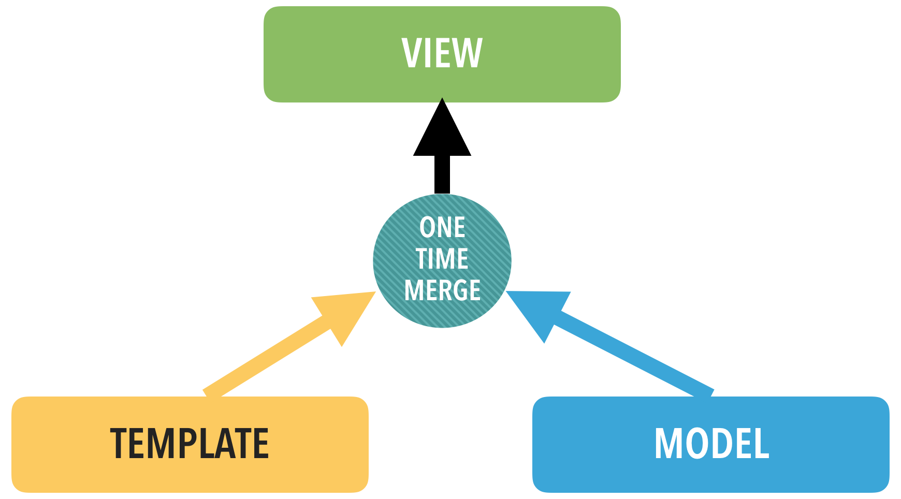

# Intro to Angular: Setup, Controller, 2-way binding

### Objectives

- Describe why learning Angular is important
- Set up an Angular app and test that it works
- Build a very basic controller with fake data
- Render basic controller data in the view
- Bind basic data with a controller variable

### Preparation

- Have a thorough understanding of JS
- Know how to build JS constructor functions
- Download the [starter code](starter-code)

## Intro - What is AngularJS and Why Should You Learn it? (20 mins)


Angular is An open source JS framework maintained by Google - maybe you've heard of them?  It was created nearly 6 years ago - its longevity is a testament to its capability and usefulness.  AngularJS is one of the most widely adopted MVC JS frameworks in use today and is a valuable job skill to put on your resume.

AngularJS provides the following benefits when used to develop web apps:
- Enables us to organize and structure Single Page Apps using the popular MVC design pattern
- Makes us more productive when developing web apps because it provides features, such as data binding, that requires less code from the developer
- Was designed with testing in mind

### Dependency Injection

Before we talk about Dependency Injection, we need to define *Denpendency*. You have seen this word before when you set up `bower` packages or `npm` modules. These are package managers which deal with *dependencies among the modules of a sofware*. We need that because most modules require other modules to do the work for them, for example, one would not just write a library to send HTTP requests these days (well, if you want to waste your time like that, be my guest). You *always* want to use an existing module so that you can stay away from the nitty-critty details of the (mostly boring) HTTP protocols and work on more interesting stuff.

We can apply the same concept in a smaller scale when we are just coding on a software component. Here we are talking about *dependencies among objects or functions*. If JS object A needs JS object B to work then A is dependent on B. Here is a brief excerpt from the [Dependency Injection section of the Angular JS official guide](https://docs.angularjs.org/guide/di):

>
> There are only three ways a component (object or function) can get a hold of its dependencies:
>
>   1. The component can create the dependency, typically using the new operator.
>   2. The component can look up the dependency, by referring to a global variable.
>   3. The component can have the dependency passed to it where it is needed.
>

For the first option, it will look like the below example where we need to pass in engine-related parameters to the `Car` constructor function so that we can create an Engine object inside.

```javascript
var Car = function(brand, engine_components) {
  this.brand = brand;
  this.engine = new Engine(engine_components);
  // may call other functions in the engine to initialize it
}
```

For the second option, we may have a global function that returns `Engine` objects based on some parameters passed:

```javascript
var getEngine = function(engine_components) {
  var engine;
  // Assemble an engine based on the components
  // call other functions in the engine to initialize it
  return engine;
}

var Car = function(brand, engine_components) {
  this.brand = brand;
  this.engine = getEngine(engine_components);
}
```

For the third option, which is the preferable one, the `Car` constructor function simply got the `Engine` object handed to it:

```javascript
var Car = function(brand, engine) {
  this.brand = brand;
  this.engine = engine;
}

var engine1 = new Engine(......);  // need a bunch of parameters!!
var car1 = new Car('toyota', engine);
```

The third option sounds great but whoever calls the `Car` constructor function *STILL need to create the engine*. AngularJS has a solution for that. It has an component called the [injector](https://docs.angularjs.org/api/ng/function/angular.injector) which helps you to locate a component, create it and then **INJECT** into the module (you always start writing a module in AngularJS!!) you are working on. We will see how this works in later sections.

If you want to read more about this, read the [Dependency Injection section of the Angular JS official guide](https://docs.angularjs.org/guide/di).

### The Components of AngularJS


#### Modules

Modules are containers for related code.  The concept of *modules* is prevalent throughout programming, and here, we can consider it essentially a container for our app.

#### Config & Routes

Each AngularJS module has a *config* method that allows us to provide code that runs when a module is loaded.  The *config* method is used most commonly to setup routing.

#### Controller

Controllers in AngularJS serve two primary purposes:

- Initialize the data used for the view they are attached to
- Contain the primary code to respond to user events, such as when a user clicks on a button

A controller is a JS constructor function that is instantiated by the _ng-controller_ directive.

#### Services & Factories

Services provide a way to organize related code and data that can be shared by controllers and even other services. Unlike controllers, which are instantiated and destroyed as the views they are attached to come into and out of view, services are created once (singletons) and persist for the life of the application.

Services should be used to hold the bulk of your application's logic and data, thus keeping controllers focused on what they are responsible for. Often, you can consider a service or factory something like a model or Ruby class.

#### Directives

Directives are "markers" in HTML - most commonly as attributes and custom element tags. When processed by AngularJS's HTML compiler, they attach behavior to DOM elements or even transform them and/or their children.


#### Filters

Filters are used to transform data. They are very flexible and can be used for formatting text in a view, such as making it all uppercase, or used to filter and sort an array of items.

#### The AngularJS Mindset

Programming a web app with AngularJS requires a different mindset. To use AngularJS effectively, it helps to think of your application being driven by data - you change data, the app responds. We naturally think more procedurally when coding, we attach an event handler and write code to respond.

Let's look at an example of the different approaches.  Say we want an edit form to show when a button is clicked:

- Procedurally, we would attach an event handler to the button.  The handler code would select the element and set its display property to something besides "none".
- Using AngularJS, we declare a click handler on the Button element.  The handler could set a variable named editMode equal to true, and the view would respond automatically.
- Remember, drive your application using data - your data model is the single source of truth!

### SPA Architecture

Single Page Applications (SPA) are all the rage today. A misconception is that a SPA has only a single view - this is far from the truth!  The single page aspect of a SPA refers to a single page coming from the server, such as our _index.html_ page.  Once loaded, the SPA changes views by using _client-side_ routing, which loads partial HTML snippets called templates.


Client-side routing requires something known as a _router_.  A router in AngularJS, at a minimum, is used to define our routes, specify the template for that route, and specify which controller to attach to that view. You'll get to see routers in action in a later lesson.


## Basic Setup - Modules, Controllers, Views - Codealong (20 mins)

Like a few frameworks we've seen, there's not a particular way to organize your application to make Angular work. We'll have to create our own, but let's try to keep it standard.

In your starter folder, you'll see some empty files and a couple of folders.

First, let's get Angular from [Google's CDN](https://developers.google.com/speed/libraries/#angularjs) and paste into script tag in the ```<head>```.

```html
 <head>
   <meta charset="utf-8">
   <title>Intro to Angular</title>
   <script src="https://ajax.googleapis.com/ajax/libs/angularjs/1.5.0/angular.min.js"></script>
 </head>
```


Now, we set up a module. Go to your `app.js` file, and all it takes is this little line:

```js
// Define a new module. The first argument is what we want to call our app, the second is an array of dependencies.
// The second parameter is required if we are creating new module.
// So if there are no dependencies, we still need to pass in an empty array.
angular.module('IntroToAngularApp', []);
```

This sets our app up. It's important to include that array when defining a module, even if there are no dependencies – that tells Angular we're initializing a module.

Now, back in our HTML, make sure your `app.js` is included in a script tag, and add an `ng-app` directive in the `<html>` tag.
```html
<!DOCTYPE html>
<html ng-app="IntroToAngularApp">
  <head>
    <meta charset="utf-8">
    <title>Intro to Angular</title>
    <script src="https://ajax.googleapis.com/ajax/libs/angularjs/1.3.15/angular.min.js"></script>
    <script src="js/app.js"></script>
  </head>
```

Since we defined it in `app.js` with a name of `IntroToAngularApp`, we just reference what we named it here. This tells the HTML to use that module.

Now, let's just check to make sure it worked. If it worked correctly, we should be able to put some simple expression in our HTML, and Angular will render it.

```html
<body>
{{ 1 + 1 }}
</body>
```

If Angular's working, it'll add our numbers together and spit out a 2 on the page – that's how templating works in Angular, inside curly brackets.

Open it up in a browser to check. And remember – if it doesn't work, always check your browser's console for errors!


### A Very Basic Controller - Codealong (15 mins)

So, in Angular's flavor of MVC, controllers are intended to primarily:

1. Respond to user actions.
2. Provide data to the view (occasionally referred to the view-model).

Now, let's stub out a new controller and plug it into our module:

```bash
touch js/homeController.js
```

Here we use a variable `myApp` to store a reference to our module. Note that we **do not** pass in the second parameter again as this optional parameter is **ONLY** required when we want to create a new module. You can read about this somewhat pecuilar behavuor in the official documentation of the [angular.module](https://docs.angularjs.org/api/ng/function/angular.module) method.

Next we can use the `controller` method to register a controller to the `myApp` module. The first argument is the name of the controller (the convention is to use camel case, like the name of a constructor function). The second argument is an array which can take **an arbitary number of elements**. If the array has `n` elements, the first `n-1` elements of the array are used to define the **dependencies** of the controller, i.e. the other modules this controller depends on. The last element of the array is **always** a function which is the actual contructor function of your controller.

```javascript
// When only the name of the module is passed in,
// the 'module' method returns the specified module.
var myApp = angular.module('IntroToAngularApp');

myApp.controller('HomeController', ['$scope', function($scope) {
  $scope.awesome = true;
}]);
```

You may notice this interesting variable called `$scope`. `$scope` is a built-in service provided by Angular which allows a controller to gain access to the view. You should always add this as a dependency when you define your controller.

There is an alternative way to do the above. In this alternative implementaton, we have to explicitly declare the constructor function for the controller and we have to pass the function reference to the `module` method (see the second parameter).

```javascript
angular.module('IntroToAngularApp')
       .controller('HomeController', HomeController);

function HomeController($scope) {
  $scope.awesome = true;
}
```

Later, we'll see how you can let controllers just connect models and the views - like we're used to - but since we don't have a model, let's just hardcode some junk in there.

## Independent Practice - Adding data to your Controller (5 minutes)

Take five minutes and add some data into your `HomeController`. Any sort of data will do so just come up with a few different data types to play with.

- - -
```js
var myApp = angular.module('IntroToAngularApp');

myApp.controller('HomeController', ['$scope', function($scope) {
  $scope.awesome = true;
  $scope.numbers = [4, 8, 15, 16, 23, 42];
  // etc, etc.
}]);
```

### Connecting Controller To The View - Codealong (10 mins)

The last step here is to connect our controller to the view. We attach any controllers to some div or HTML tag in our view. But first, make sure to include any newly created JS files.

```html
<html ng-app="IntroToAngularApp">
  <head>
    <meta charset="utf-8">
    <title>Intro to Angular</title>
    <script src="https://ajax.googleapis.com/ajax/libs/angularjs/1.5.0/angular.min.js"></script>
    <script src="js/app.js"></script>
    <script src="js/homeController.js"></script>
  </head>
```

Now:

```html
<body>
  <section ng-controller="HomeController">
    {{awesome}}
  </section>
</body>
```

When you render the page, it should actually render! That's awesome – that means we're working with data that's coming from our controller, and that's the core building block to more complex apps!

#### Advanced Topic: But how does it work?

With Javascript in play, our browser is naturally event-driven. For example, when you have an onClick event listener placed on a button, you also have an event handler that can update the DOM in some way. The 'magic' behind Angular, the way that it seemingly knows to update the DOM when need be, is due to the fact that it extends the traditional js event-loop by extending it with angular context.

Every time you use Angular to bind something in the UI, whether it be via handlebars or any ngDirective, you are telling your related Angular module that they are extensions of your angular context and to watch them for changes by adding them to the $watch list. This event loop is known as the $digest cycle and whenever there is a change in Angular context ($scope), Angular will go through _ALL_ of its context and update any model(s) with a value that has been updated, a concept known as "dirty-checking."


### Independent Practice (10 minutes)

In pairs, for the next 10 minutes, work together to take the random data you put into your controllers earlier and show them in the view. After, experiment with making a new controller from scratch, including it in your HTML, and showing that in the view, too – it'll give you a little practice with all the setup.

## Data Binding

Data Binding, in the context of MVC, is the synchronization of data between Model and View. As you have seen previously in Rails and Hapi, we use things called `templates` as our views. Templates are HTML files where we can use other programming languages to populate data within, such as `ejs` for Embedded JavaScript and `erb` for Embedded Ruby. So far, what we have seen are just **one way binding** in which once we bound a model status (value) to the view, that value inside the view will never change unless we **render the view again** or if we use jQuery code to do that explicitly.



In AngularJS, we have **Two-Way Binding**. The following figure describes how it works:


The template (HTML + AngularJS code) is compiled into a View object. And then:
  - When data inside a model change, the view will get updated.
  - When data in the view change, the changes will be propagated back to the model.

The implication is that we no longer need to use jQuery to directly modify our view. We just need to update the model and the view will be automatically update by Angular.

### AngularJS Stop Watch - Demo (30 mins)

In order to demonstrate Two-Way Binding, we will revisit an AngularJS version of the simple stop watch example we have previously used in Week 2. You can get the code by `git clone` the [AngularJS Stop Watc repo](https://github.com/wdi-hk-10/lesson-angular-stop-watch) and spend 5 - 10 minutes trying to read through the code and annotations within. Then we will discuss this in class.


## Conclusion (5 mins)
- How do we define a new module when starting an application?
- When you create an example controller from scratch, what type of JS function is this?
- How do we render data in the view? What does the templating look like in Angular?
