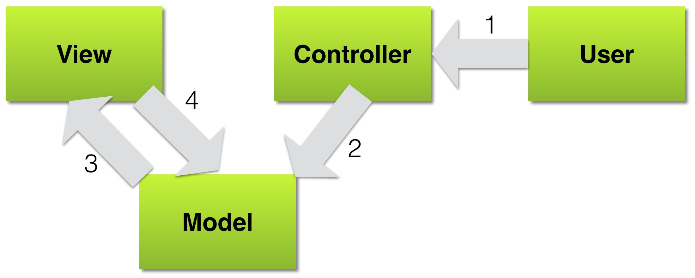
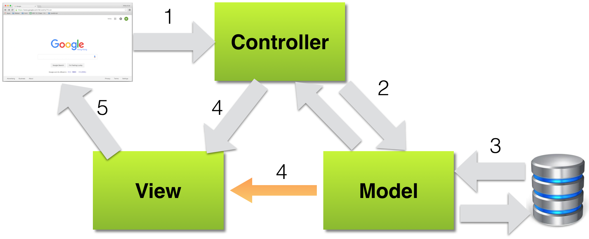
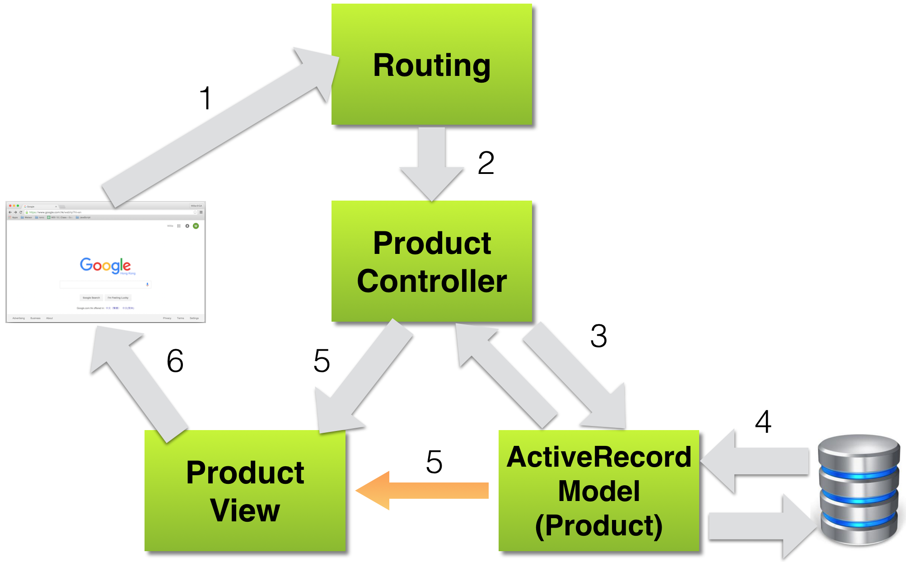

# Rails Architecture Introduction

### Objectives
*After this lesson, students will be able to:*
  - Explain what is MVC architecture
  - Explain the key responsibilities of Model, View and Controller
  - Explain how MVC architecture is applied in Rails
  - Explain what is ORM and why we need it

### Preparation
*Before this lesson, students should already be able to:*
  - Understand basic OOP concepts
  - Do basic Ruby programming
  - Understand general software system architecture: client, server and database

## Introduction: Software Design and Design Patterns

We have already introduced the Object-Oriented Programming paradigm in an earlier lesson. **Objects** are data structures that encapsulates states (aka. data, properties or attributes) and behaviors (aka. procedures or methods). We define **classes** and create **objects** as instances of **classes**. Then we can use **objects** to interact with each other as we design and construct our programs. But how do we **design** our programs? Are there guidelines we can follow? Are there good practices or time-tested solutions that we can refer to? The good news is... **YES**.

In the world of programming, we have the concept of **Design Patterns**. A software design pattern is:
  - a reusable solution to commonly recurring problems. 
  - **NOT** a completed design **NOR** a software module.
  - a formalized best practices on how to tackle a problem in a certain domain.
  - programming language agnostic (meaning, you can apply a pattern in _almost_ any programming language)

We are going to introduce one of a classic design patterns to you in this lesson. It is a type of **software architectural pattern** which deals with the best practices in designing, not just only software systems but software **components**. It is important to understand that a software design pattern can be applied to a component in a system, such as a GUI or a part of a GUI. We are going to look at a software architectural pattern in the next section and it is called **MVC**.

## A Brief History of MVC
Model-view-controller (MVC) is a software architectural pattern originally aimed at implementing Graphical User Interfaces (GUI) in computers. A Norwegian computer scientist called Trygve Reenskaug first introduced the idea of model-view-controller pattern to the Smalltalk-76 language back in 1979 while he was visiting the Xerox Palo Alto Research Center (PARC). The MVC concept was later implemented in the Smalltalk-80 library.

Smalltalk is a language first appeared in 1972 and reached the first stable release as Smalltalk-80 in 1980. It is one of the earliest Object-Oriented programming languages and it has huge influence on other languages such as Objective-C, Java, Python and **Ruby**.

## Model, View and Controller - the Classic Design
In the original MVC design, applications were broken into three types of components: models, views and controllers. 

### Model

The model is responsible for maintaining the states of the application. Sometimes the states only last for a few interactions with the user. Other times, the states are permanent and have to be persisted in an external store, such as a database.

A model is also where we should enforce the **business logics** that apply to the data. A classic example would be a bank account: in an imaginary banking application, a bank account model should not allow a debit of $100 if the account only has $50. 

### View

The view is where we display the states of the model(s). In the classic design, the view would be notified when the model has changed and the view is responsible to get the data from Model. 

Note the we can have different views that display the same data from the model. For example, one view can list data in a table and anothe view can use graphs and charts to do that.

### Controller

The controller captures user's actions and informs the model that there are changes to the data. 

### Puting it together
The MVC architecture is a fine example of **separation of concerns** which means that we don't want to clutter the model with the logics of rendering data as these should belong in the view. Likewise, the view does not need to know how to  handle the business logics. In other words, the code will be **less coupled** and will be easier to write and maintain. Here is how the model, view and controller should interact with each other.

  

  1. The user performs an action.
  1. The controller interprets this action as a request to change the state of the model and it informs the model.
  1. The model changes its state and then informs the view that it has changed.
  1. The view then asks the model for its current state and updates itself accordingly.

## MVC: The Web Approach
The classic MVC design mainly deals with GUI system that runs locally in the user's machines. When we apply the MVC design to the architecture of a Web application, one notable difference is that the user is no longer directly interacting with the application. Instead, actions arrive in the form of requests firing from web browsers. Here is the revised MVC model for (general) web applications.

  

  1. Web broswer (user) sends a request.
  1. The controller interprets this request based on the URL and HTTP method used and then informs the model.
  1. The model then retrieves or persists the data obtained from the request and then reply the controller with the response and/or data.
  1. The controller invokes the view.
  1. The view renders the next browser screen by using the data provided by the controller, which in turn was provided by the model.

This is only a high level view on how to apply the MVC design to a web application. Next we will look at how Rails does this by using the exact Rails terminology.

## MVC in Rails
This is how the MVC architecture is implemented in Rails. Imagine the web browser sends a request to the url http://my.bookstore.com, an online bookstore which is backed by a Rails application.

  
  
  1. Web browser sends a GET request to the url http://my.bookstore.com/products/12345
  1. The **Router** in Rails matches the route pattern and splits the path to analyze:
    - The `products` part is taken to be the name of a controller so Rails creates a new instance of the Ruby class `ProductController`. This is by default located in `app/controllers/product_controller.rb`.
    - The `12345` part is the `id` of a product. Rails recognises this pattern, along wit the GET method, suggests the `show` action (based on the route configurations).
    - Rails then invokes the `show` method on the `ProductController` instance created.
  1. The method `show` of the `ProductController` is invoked. The `ProductController` will use the `ActiveRecord` model `Product` to look up the item with id `12345`.
  1. The `Product` model fetches the item `12345` from the database and returns the data to the `ProductController`.
  1. Rails looks for a template to display the results. It searches the directory `app/views` for a subdirectory with the same name (in plural) as the controller (`Product`) and in that subdirectory, look for a file named after the action, `show.html.erb` (ERB stands for _Embedded Ruby_).
  1. Ruby processes `app/views/products/show.html.erb` through the ERB templating system and returns the rendered results to the browser.

While this looks more complex then the previous versions, if you get to look at the code you will be amazed how **FEW** code you actually need to write in order to achieve this. We will look at Rails in more details in another lesson. Before that, you may notice a new term called `ActiveRecord` from the above description so let's take a quick look at this first.

## ActiveRecord... or What is ORM?

Before we can talk about `ActiveRecord`, we need to introduce one more new concept called ORM (Object Relational Mapping). It is a programming technique for converting data between the data types of an **Object**-Oriented language and a **Relational** database. 

If you leave all the nitty-gritty details behind, you can view ORM as a way to **read a row of data from a DB table and return it as an object*. While this is not 100% correct, it is the easiest way to understand what ORM does. The nitty-gritty details we left behind include how to convert DB data types into the data types used in the OO language or how to handle the one-to-many and many-to-many (to name a few) relations between different types of objects. We will cover this in a future lesson.

In short, `ActiveRecord` is the ORM tool we use in Rails. It helps us to convert data retrieved from DB into Model objects we defined in the `app/models`. We will study this in greater details soon.

## Conclusions

### Quick Assessments
  1. What is a Design Pattern?
  1. What are the main responsibilities of Model, View and Controller?
  1. What are the benefits of using the MVC pattern?
  1. What is ORM? How can it help us?

